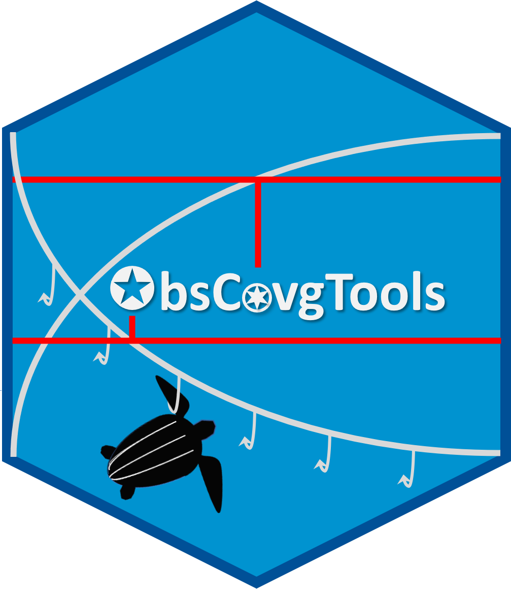

<!-- README.md is generated from README.Rmd. Please edit that file -->

# ObsCovgTools 

<!-- badges: start -->
[](https://github.com/kacurtis/ObsCovgTools/releases)
[](https://doi.org/10.5281/zenodo.3603464)
<!-- badges: end -->

### Description

ObsCovgTools provides tools for evaluating fishery observer coverage, 
particularly with respect to documenting and estimating rare bycatch. Current 
functionality includes evaluating observer coverage in terms of (1) probabilities 
of observing a bycatch event and of any bycatch occurring in total effort, given 
mean bycatch rate, dispersion index (variance to mean ratio in the bycatch rate), 
and total fishery effort; (2) upper confidence limit of bycatch when none was 
observed, given total fishery effort and dispersion index; and (3) bycatch 
estimation CV (coefficient of variation), given bycatch rate, dispersion 
index, and total fishery effort. Estimates in all cases are based directly on the 
corresponding Poisson or negative binomial probability distribution.

### Caveat

The current implementation of ObsCovgTools assumes that (1) observer coverage is 
representative, (2) bycatch is in terms of individuals (not weight) per unit 
effort, and (3) the specified dispersion index reflects the highest level of any 
hierarchical variance (e.g., using dispersion index at trip level if greater than 
that at set level). Violating these assumptions may result in negatively biased 
projections of observer coverage required to meet specific objectives. Users may 
want to explore uncertainty in dispersion index and in bycatch per unit effort by 
varying those inputs.

### Shiny app

This package has been implemented as a Shiny web application, coauthored by 
Howard Coleman, which can be accessed at https://connect.fisheries.noaa.gov/content/bb44513d-4956-44dd-b0a6-673c9f2a3e3a

### Citation

If you use ObsCovgTools results in publications or talks, please cite the primary citation:

Curtis K. A., Carretta J. V. 2020. ObsCovgTools:  Assessing observer coverage needed to document and estimate rare event bycatch. Fisheries Research, 225: 105493. https://doi.org/10.1016/j.fishres.2020.105493

You can also cite the package, updating the version number and year if you use a more recent version:

Curtis K. A. 2020. ObsCovgTools: Evaluate Fishery Observer Coverage for Bycatch Estimation. R package version 3.1.1. https://kacurtis.github.io/ObsCovgTools

### Funding

Development of the ObsCovgTools package and the Shiny application was supported 
by a grant from the National Marine Fisheries Service (NMFS) Office of Science 
and Technology, through a contract to Ocean Associates, Inc. 


<!-- Do not edit below. This adds the Disclaimer and NMFS footer. -->

****

```{r add-disclaimer, echo=FALSE, results='asis'}
url <- "https://raw.githubusercontent.com/nmfs-fish-tools/Resources/master/Disclaimer.md"
childtext <- readLines(url)
Encoding(childtext) <- "UTF-8"
cat(childtext, sep="\n")
```

****

```{r footer, echo=FALSE, results='asis'}
url <- "https://raw.githubusercontent.com/nmfs-fish-tools/Resources/master/footer.md" 
childtext <- readLines(url)
cat(childtext, sep="\n")
```


